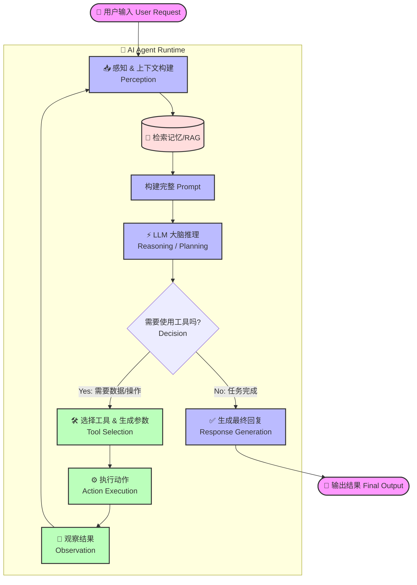
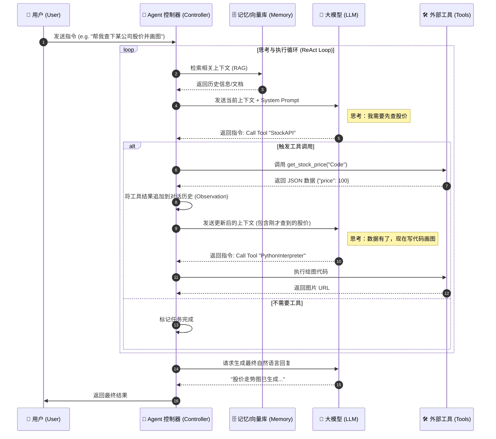

# Agent

在人工智能领域，**Agent（智能体）** 是一个核心概念，代表了 AI 从单纯的“感知与理解”向“自主决策与行动”的跨越。

简而言之，大模型（LLM）通常被视为“大脑”，而 **Agent 则是给这个大脑装上了“手脚”和“感官”**，让它能够与环境交互并解决复杂任务。

以下是对 AI Agent 概念的系统性拆解：

------

## 1. 核心定义：什么是 Agent？

**Agent** 是指一个能够感知环境、进行推理、制定计划，并执行动作以实现特定目标的自主系统。

传统的 AI 模型（如 ChatGPT 的基础对话模式）是被动的：你给它输入，它给你输出。

而 Agent 是**主动**的：你给它一个目标，它会自己想办法去达成。

核心公式：
$$
Agent = LLM（大脑）+ Planning（规划）+ Memory（记忆）+ Tools（工具使用）
$$

------

## 2. Agent 的四大核心组件

根据目前主流的架构（如 Lilian Weng 的定义），一个现代 AI Agent 通常包含以下四个部分：

### A. 核心大脑 (The Brain / Profiling)

通常由大语言模型（LLM）扮演。

- **作用：** 负责理解自然语言、逻辑推理、拆解任务和决策。
- **例子：** 面对“帮我订一张去上海的票”这个指令，LLM 负责分析意图，提取时间、地点等关键信息。

### B. 规划 (Planning)

Agent 在行动前需要思考“怎么做”。

- **子目标分解 (Decomposition)：** 将一个大的抽象目标（如“写一个贪吃蛇游戏”）拆解为多个可执行的小步骤（生成代码 -> 运行测试 -> 修复错误）。
- **反思与修正 (Self-Reflection)：** Agent 会检查自己的执行结果。如果第一步失败了，它会重新规划，而不是一条路走到黑。
  - *常见技术：* Chain of Thought (CoT), ReAct (Reasoning + Acting)。

### C. 记忆 (Memory)

为了处理长任务，Agent 需要记住上下文。

- **短期记忆：** 上下文窗口（Context Window），记住当前的对话和临时的思考过程。
- **长期记忆：** 通常使用**向量数据库 (Vector Database)**。Agent 可以把过去的经验、文档或知识库存储起来，需要时通过检索增强生成 (RAG) 调取，实现“过目不忘”。

### D. 工具使用 (Tool Use / Action)

这是 Agent 区别于普通聊天机器人的关键。

- **作用：** 连接数字世界或物理世界。Agent 可以调用 API、浏览网页、执行代码、查询数据库或操作软件。
- **例子：** LLM 本身不能计算复杂的数学题，但 Agent 可以调用一个“计算器工具”或者是 Python 解释器来得到精确结果。

------

## 3. Agent 的工作流程 (The Loop)

一个典型的 Agent 工作流是一个闭环系统：

1. **感知 (Perception)：** 接收用户指令（例如：“分析这周的股票趋势”）。
2. **规划 (Planning)：** 大脑思考：“我需要先上网查数据，然后用 Python 画图，最后写总结。”
3. **行动 (Action)：** 调用搜索工具查数据，调用代码解释器画图。
4. **观察 (Observation)：** 获取工具返回的结果（数据表格、图表）。
5. **反馈/迭代 (Feedback)：** 如果数据缺失，Agent 会决定再次搜索；如果数据完整，则生成最终报告。

------

## 4. 为什么 Agent 是 AI 的下一个阶段？

| **维度**     | **传统 LLM (Chatbot)** | **AI Agent**                             |
| ------------ | ---------------------- | ---------------------------------------- |
| **交互模式** | 信息咨询 (Information) | 任务执行 (Task Execution)                |
| **主动性**   | 被动回答               | 主动规划、试错                           |
| **能力边界** | 仅限于模型训练时的知识 | 可通过工具扩展无限能力 (联网、操作软件)  |
| **应用场景** | 写邮件、翻译、闲聊     | 自动化办公、代码开发、客户服务、数据分析 |

------

## 5. 常见类型

1. **单智能体 (Single Agent)：** 一个全能型助手，独自完成任务（如 AutoGPT）。
2. **多智能体系统 (Multi-Agent Systems - MAS)：** 多个角色化的 Agent 协作。例如，一个 Agent 扮演“产品经理”，一个扮演“程序员”，一个扮演“测试员”，它们互相对话来开发软件（如 MetaGPT, ChatDev）。

## 总结

如果把人工智能比作一家公司，**LLM 是那本厚厚的“员工手册”**（充满了知识但不会动），而 **Agent 就是那个熟读手册、会用电脑、能打电话、能解决具体问题的“优秀员工”**。

## AI Agent 工作流图

1. **逻辑流程图 (Flowchart)**：展示 Agent 如何思考、循环执行工具并得出结论（核心是 ReAct 模式）。
2. **时序图 (Sequence Diagram)**：展示各个组件（用户、Agent、LLM、工具）之间的数据交互顺序。

------

### 1. Agent 核心思考循环 (The Loop)

这个图展示了 Agent 最核心的特征：**“思考-行动-观察”的循环 (Think-Act-Observe Loop)**。

代码段

#### 流程解读：

1. **感知 (Perception)**: 接收用户请求，并结合长期记忆（RAG）。
2. **决策 (Decision)**: LLM 判断当前信息是否足够回答？
   - 如果不够，进入**工具链**。
   - 如果够了，直接**生成回答**。
3. **闭环 (The Loop)**: 注意 `Observation` 指向 `ContextBuilder` 的箭头。这是 Agent 强大的原因——它能看到工具执行的结果（比如报错了，或者查到了数据），然后根据新情况进行下一次推理。

------

### 2. 组件交互时序图 (Sequence Diagram)

这个图适合开发者查看系统架构，展示了 Agent 如何作为“中间人”协调 LLM 和外部工具。

代码段

