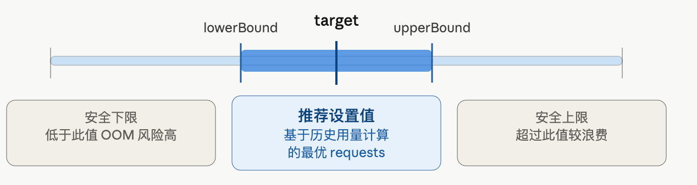

# VPA

VPA (Vertical Pod Autoscaler) 可以在 **推荐模式 (Off)** 下只给出资源建议，而不实际修改 Pod。

以下是完整流程：

## 安装 VPA

```bash
git clone https://github.com/kubernetes/autoscaler.git
cd autoscaler/vertical-pod-autoscaler
./hack/vpa-up.sh
```

## 创建 VPA 对象（仅建议模式）

关键是将 `updateMode` 设为 `"Off"`，VPA 只计算推荐值，不自动修改资源：

```yaml
# vpa-recommendation.yaml
apiVersion: autoscaling.k8s.io/v1
kind: VerticalPodAutoscaler
metadata:
  name: my-app-vpa
  namespace: default
spec:
  targetRef:
    apiVersion: apps/v1
    kind: Deployment
    name: my-app          # 指向你的 Deployment
  updatePolicy:
    updateMode: "Off"     # 仅建议，不自动修改
  resourcePolicy:
    containerPolicies:
    - containerName: "*"
      minAllowed:
        cpu: 10m
        memory: 50Mi
      maxAllowed:
        cpu: 4
        memory: 8Gi
kubectl apply -f vpa-recommendation.yaml
```

## 查看建议值

等待几分钟后（VPA 需要收集 metrics 数据），查看推荐结果：

```bash
kubectl describe vpa my-app-vpa
```

或用 JSON 格式更清晰地提取：

```bash
kubectl get vpa my-app-vpa -o json | jq '.status.recommendation'
```

输出示例：

```json
{
  "containerRecommendations": [
    {
      "containerName": "my-app",
      "lowerBound": { "cpu": "50m",  "memory": "128Mi" },
      "target":     { "cpu": "200m", "memory": "256Mi" },
      "upperBound": { "cpu": "500m", "memory": "512Mi" }
    }
  ]
}
```

## 三个推荐值的含义



### 实际使用建议

**1. 批量查看所有 VPA 建议：**

```bash
kubectl get vpa -A
```

**2. 将 `target` 值写入你的 Deployment：**

```yaml
resources:
  requests:
    cpu: "200m"      # 来自 target
    memory: "256Mi"  # 来自 target
  limits:
    cpu: "500m"      # 参考 upperBound
    memory: "512Mi"
```

**3. `updateMode` 的三种选项：**

| 模式      | 说明                                       |
| --------- | ------------------------------------------ |
| `Off`     | 只给建议，不修改（推荐生产环境先用此模式） |
| `Initial` | 仅在 Pod 创建时应用推荐值                  |
| `Auto`    | 自动驱逐 Pod 并重建以应用新值              |

**注意事项：**

- VPA 需要至少几分钟～几小时的 metrics 历史才能给出有意义的建议
- VPA 与 HPA（基于 CPU/Memory）**不能同时使用**，会冲突；但可以与基于自定义 metrics 的 HPA 共存
- 推荐先在测试环境用 `Off` 模式观察一周，再决定是否切换到 `Auto`