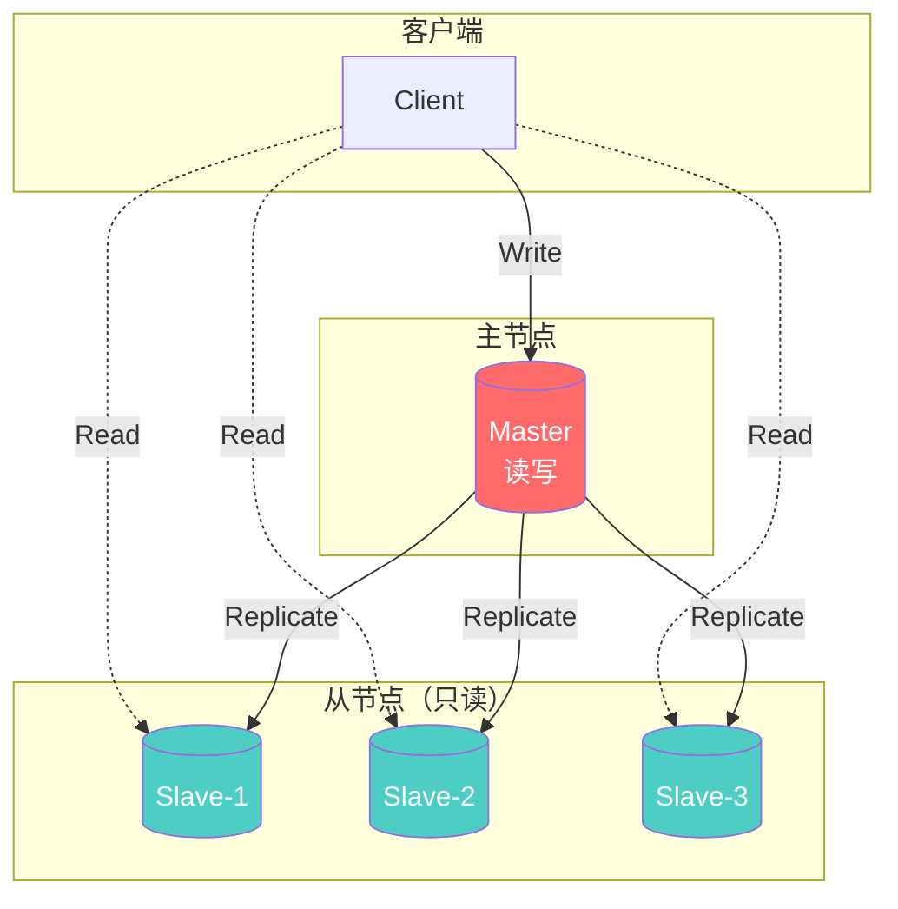

# 主从复制



Redis 的主从复制（Master-Slave Replication，在 Redis 5.0 之后官方更倾向于使用 Primary-Replica 这一术语）是其高可用架构的基石。

------

## 一、 什么是主从复制？为什么要用它？

简单来说，主从复制就是将一台 Redis 服务器（主节点 Master）的数据，单向复制到其他 Redis 服务器（从节点 Replica）。

**核心作用包括：**

1. **数据冗余：** 实现数据的热备份，是持久化之外的一种数据冗余方式。
2. **故障恢复：** 当主节点出现问题时，可以由从节点提供服务，实现快速的故障恢复。
3. **负载均衡（读写分离）：** 主节点负责处理写操作，从节点负责处理读操作。在读多写少的场景下，可以大幅提高服务器的并发量。
4. **高可用的基石：** 它是 Redis 哨兵模式和集群模式实现的基础。

------

## 二、 主从复制的核心概念

在深入流程之前，我们需要了解三个关键的内部机制：

- **Run ID（运行 ID）：** 每个 Redis 实例启动时都会自动生成一个随机且唯一的 40 位十六进制字符串。从节点在首次复制时会保存主节点的 Run ID，用于判断断线重连后主节点是否发生了变化。
- **Replication Offset（复制偏移量）：** 主节点和从节点都会维护一个偏移量。主节点每次向从节点发送 N 个字节的数据时，自己的偏移量增加 N；从节点每次收到主节点传来的 N 个字节的数据时，自己的偏移量也增加 N。通过对比主从的偏移量，就能知道两边的数据是否一致。
- **Replication Backlog Buffer（复制积压缓冲区）：** 这是主·节点维护的一个固定长度的环形缓冲区（默认 1MB）。当主节点进行命令传播时，不仅会将命令发送给所有从节点，还会写入这个缓冲区。如果从节点短暂断开连接，重新连接后，可以尝试从这里获取丢失的数据，避免代价高昂的全量同步。

------

## 三、 主从复制的完整流程

主从复制的过程主要分为三个阶段：**建立连接**、**数据同步** 和 **命令传播**。

### 1. 建立连接阶段

当你在从节点上执行 `REPLICAOF <masterip> <masterport>` 命令后，从节点会与主节点建立网络连接，并进行身份验证（如果配置了密码）。

### 2. 数据同步阶段（核心）

这是最关键的一步，决定了数据如何对齐。数据同步分为两种情况：**全量复制**和**增量复制**（部分复制）。

**A. 全量复制（Full Resynchronization）**

通常发生在**首次同步**，或者从节点断开时间过长，导致复制积压缓冲区的数据已经被覆盖时。

- **步骤：**
  1. 从节点向主节点发送 `psync ? -1` 命令，请求全量同步。
  2. 主节点收到请求后，执行 `bgsave` 在后台生成 RDB 快照文件，并将这段时间内产生的新写命令存入缓冲区。
  3. 主节点将 RDB 文件发送给从节点。从节点接收并载入 RDB 文件（在此之前会清空自己的旧数据）。
  4. 主节点将缓冲区的增量写命令发送给从节点，从节点执行这些命令，最终达到与主节点一致的状态。
- **注意：** 全量复制非常消耗资源（主节点的 CPU/内存/磁盘 IO，以及网络带宽），应尽量避免在高峰期发生无谓的全量复制。

**B. 增量复制（Partial Resynchronization）**

用于处理**网络闪断**等导致的短时间断线重连情况。

- **步骤：**
  1. 从节点重新连接上主节点后，发送 `psync <runid> <offset>` 命令（携带之前保存的主节点 Run ID 和自己的复制偏移量）。
  2. 主节点核对 Run ID 匹配，并且发现该 `<offset>` 之后的数据仍然存在于**复制积压缓冲区**中。
  3. 主节点向从节点发送 `+CONTINUE` 回复，并将缓冲区中缺失的那部分数据发送给从节点。
  4. 从节点接收并执行这些命令，快速追平数据。

### 3. 命令传播阶段

当数据同步完成后，主从节点进入平稳的运行状态。此时主节点会将自己执行的写命令源源不断地异步发送给从节点，从节点执行相同的命令，保证数据持续一致。

在这个阶段，主从节点会维持**心跳机制**：

- 主节点默认每隔 10 秒向从节点发送 `PING` 命令。
- 从节点默认每隔 1 秒向主节点发送 `REPLCONF ACK <offset>` 命令，汇报自己的复制偏移量，主节点借此判断从节点是否存活以及数据是否有延迟。

------

## 四、 配置方式

```bash
# 从节点配置（redis.conf）
replicaof <master-ip> <master-port>

# 或在运行时执行命令
REPLICAOF 192.168.1.100 6379
```

## 五、优缺点

1. **不具备自动容错和恢复功能：** 如果主节点宕机，需要手动将从节点晋升为主节点（这就是为什么后来有了 Sentinel 哨兵模式）。
2. **写能力受限：** 主节点依然是单点，无法横向扩展写操作和存储容量（这就是为什么后来有了 Cluster 集群模式）。

| 优点                     | 缺点                   |
| ------------------------ | ---------------------- |
| 配置简单，易于部署       | 主节点故障需手动切换   |
| 支持读写分离，提高读性能 | 写操作无法水平扩展     |
| 数据冗余，提供备份       | 全量同步时主节点压力大 |
|                          | 异步复制可能数据丢失   |