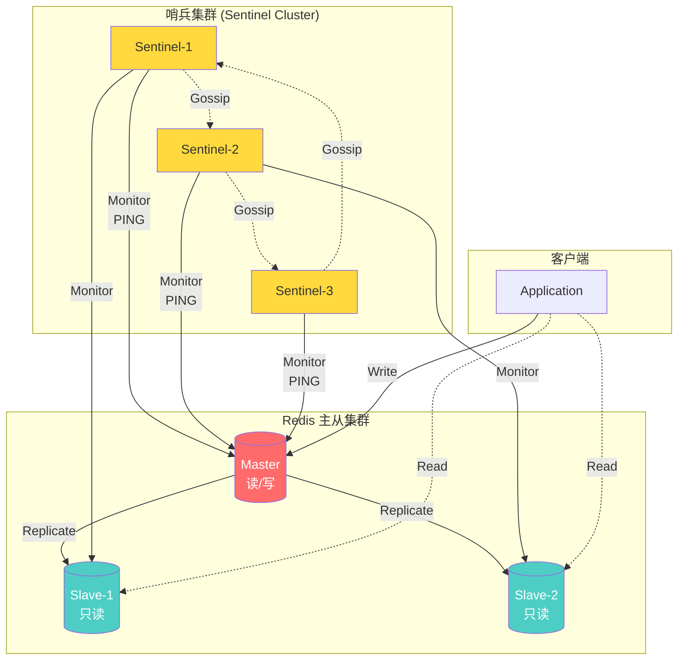

# 哨兵模式



主从复制虽然解决了数据备份和读扩展的问题，但它的致命伤是**无法自动容错**。

主节点一旦宕机，整个系统的写操作就会瘫痪，必须人工介入切换。

为了解决这个问题，Redis 官方推出了**哨兵模式（Sentinel）**。

---

## 一、 什么是哨兵模式？它的核心职责是什么？

哨兵（Sentinel）本质上是一个运行在特殊模式下的 Redis 进程。

它就像是一个尽职尽责的“监控摄像头”加“自动化运维机器人”，专门负责看管你的 Redis 主从集群。

哨兵承担着四个核心职责：

1. **监控（Monitoring）：** 持续不断地检查你的主节点（Master）和从节点（Replica）是否正常运作。
2. **通知（Notification）：** 当被监控的某个 Redis 节点出现问题时，可以通过 API 向管理员或者其他应用程序发送通知。
3. **自动故障转移（Automatic Failover）：** （最核心的功能）如果主节点宕机，哨兵会自动将其中一个从节点升级为新的主节点，并将其他从节点重新指向新的主节点。
4. **配置提供者（Configuration Provider）：** 客户端（比如 Java 应用中的 Jedis 或 Lettuce）不再直接硬编码主节点的 IP，而是连接到哨兵，向哨兵询问当前主节点的地址。发生故障转移后，哨兵会将新主节点的地址推送给客户端。

---

## 二、 哨兵如何判断主节点“死”了？（SDOWN 与 ODOWN）

这是哨兵机制中最精妙的设计之一。为了防止网络抖动导致的误判，哨兵引入了两个级别的下线状态：

1. **主观下线（SDOWN - Subjective Down）：**
   1. 哨兵默认每秒向主节点发送一次 `PING` 命令。
   2. 如果主节点在配置的 `down-after-milliseconds` 时间内没有回复有效的响应，**这台哨兵**就会在自己的小本本上记下：我认为主节点挂了。这就是主观下线。

2. **客观下线（ODOWN - Objective Down）：**
   1. 单台哨兵的判断可能是因为自身网络不好。
   2. 所以，当一台哨兵判断主节点 SDOWN 后，它会向其他哨兵节点发送命令，询问它们是否也认为主节点挂了。
   3. 如果同意主节点挂掉的哨兵数量达到了配置的 **Quorum（法定票数）**，哨兵集群就会达成共识：主节点是真的挂了。这就是客观下线。

*注：只有主节点会有 ODOWN 状态，从节点如果失去联系，只会被标记为 SDOWN，不会触发后续的故障转移。*

---

## 三、 工作原理

1. **心跳检测**：哨兵每秒向所有节点发送 PING 命令
2. **主观下线（S_DOWN）**：单个哨兵认为节点下线
3. **客观下线（O_DOWN）**：多数哨兵确认主节点下线
4. **选举新主节点**：根据优先级、复制偏移量等选举
5. **故障转移**：提升新主节点，其他从节点复制新主节点
6. **更新配置**：通知客户端新的主节点地址

## 四、 故障转移的完整实战推演

确认主节点 ODOWN 之后，一场激动人心的“夺权与重建”就开始了。

### 1. 选出“领头羊”哨兵（Leader Election）

发现主节点宕机的哨兵会有很多个，谁来负责执行故障转移呢？大家都动手会乱套。

此时，哨兵集群内部会使用类似 Raft 的共识算法进行投票，选举出一个**领头哨兵（Leader）**。

只有获得集群**半数以上**选票的哨兵才能成为 Leader，由它全权负责后续的切换工作。

### 2. 挑选新的主节点

领头哨兵要在剩下的从节点中挑一个最优秀的“太子”继承皇位。挑选规则非常严格，按顺序淘汰：

1. **淘汰不健康的：** 剔除那些已经断线、网络延迟过高、或者一直回复 PING 超时的从节点。
2. **看优先级（Priority）：** 检查 `replica-priority` 配置，数值越小的优先级越高（如果是 0 则代表永远不参与选举）。
3. **看复制进度（Offset）：** 挑选复制偏移量（Replication Offset）最大的，说明它同步的数据最完整，丢失的数据最少。
4. **看运行 ID（Run ID）：** 如果以上都一样，挑选 Run ID 最小的那个（单纯为了打破平局）。

### 3. 执行“登基”与“诏书天下”

1. **晋升新主：** 领头哨兵向被选中的从节点发送 `REPLICAOF NO ONE` 命令，让它断开原有的主从关系，正式升级为独立的主节点。
2. **收编旧部：** 领头哨兵向其他所有从节点发送 `REPLICAOF <new_master_ip> <new_master_port>` 命令，让它们开始复制新主节点的数据。
3. **通知客户端：** 哨兵通过发布订阅机制（Publish/Subscribe）通知连接在它上面的应用客户端，主节点地址已经变更。
4. **降级旧主：** 哨兵依然会持续监控那个宕机的旧主节点。一旦它恢复重启，哨兵会立刻发送命令把它降级为从节点，乖乖去同步新主节点的数据。

---

## 五、 避坑指南：为什么哨兵至少要部署 3 个？

在实际生产环境中，配置 Java 客户端连接的哨兵节点通常推荐部署 **3 个及以上的奇数个**。

* **为什么不能是 1 个？** 哨兵自己也是单点，它挂了就没有高可用了。
* **为什么不能是 2 个？** 如果部署 2 个哨兵（分别在两台机器上），当包含主节点的那台机器网络断开（脑裂），另一台机器上的单哨兵虽然能发现问题，但**它无法获得半数以上的选票（1 票不大于 2/2）**，也就无法选出 Leader 执行故障转移。
* **为什么是奇数？** 3 个哨兵最多允许 1 个宕机，4 个哨兵也最多允许 1 个宕机（因为半数以上分别是 2 和 3）。奇数个节点在保证相同容错能力的前提下，能节省一台服务器的资源。

## 六、配置方式

```bash
# sentinel.conf
port 26379
sentinel monitor mymaster 192.168.1.100 6379 2
sentinel down-after-milliseconds mymaster 5000
sentinel failover-timeout mymaster 60000
sentinel parallel-syncs mymaster 1
```

## 七、优缺点

| 优点                     | 缺点                       |
| ------------------------ | -------------------------- |
| 自动故障转移，高可用     | 配置相对复杂               |
| 监控和通知机制完善       | 写操作仍无法水平扩展       |
| 支持多个哨兵防止单点故障 | 故障转移期间可能短暂不可用 |
| 客户端自动发现新主节点   | 哨兵集群需要奇数个节点     |
