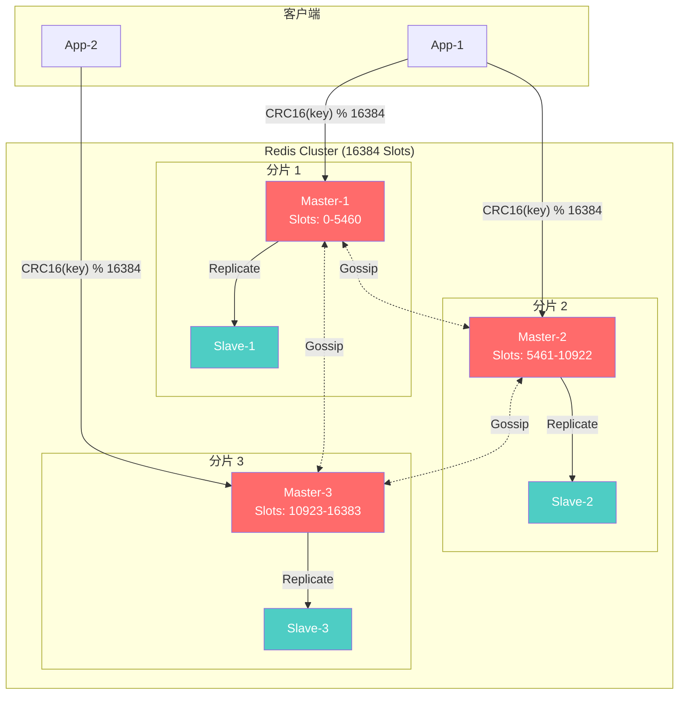

# Redis 集群模式



主从复制和哨兵模式都无法跨越物理硬件的物理极限：**单台机器的内存是有限的，单台机器的写入 QPS（每秒查询率）也是有天花板的。** 

当你的系统面临海量数据（比如需要缓存上 TB 的数据）和超高并发写入时，唯一的出路就是**水平扩容（Scale Out）**。

**Redis Cluster** 就是官方提供的数据分片（Sharding）和分布式存储解决方案。

---

## 一、 核心概念：数据分片与 16384 个哈希槽

为了把海量数据打散存放到多台机器上，Redis 集群并没有采用传统的“一致性哈希”，而是独创了**哈希槽（Hash Slot）**机制。

**哈希槽是怎么工作的？**

1. **固定总数：** 整个 Redis 集群固定划分了 **16384** 个哈希槽（编号 0 到 16383）。
2. **槽位分配：** 集群中的每一个 Master 节点，都会负责管理其中的一部分槽位。假设你有 3 个 Master 节点，分配可能如下：

   * Master A：负责 0 到 5460 号槽

   * Master B：负责 5461 到 10922 号槽

   * Master C：负责 10923 到 16383 号槽


3. **路由算法：** 当你要存入或读取一个 Key 时，Redis 会通过内置算法 `CRC16(key) % 16384` 计算出一个结果。这个结果就是该 Key 所属的槽位，系统据此将其存入对应的 Master 节点。

---

## 二、 去中心化架构：Gossip 协议

与哨兵模式不同，Redis 集群是真正的**去中心化（Decentralized）**架构。集群中没有充当路由网关的 Proxy 层，也没有专门负责监控的独立节点。

**节点之间如何沟通？**

* 集群中的所有节点通过 **Gossip 协议**相互通信（就像人类传播八卦一样）。
* 节点之间不断发送 `Ping` 和 `Pong` 消息，交换彼此的运行状态、负责的哈希槽分布等信息。
* 通过这种机制，任何一个节点都能掌握整个集群的全局拓扑结构。

---

## 三、 客户端如何找到正确的数据？（重定向机制）

既然没有中心网关，你的 Java 代码（客户端）向集群发起读写请求时，究竟该连哪个节点呢？

1. **随意连接：** 客户端可以向集群中的任意一个节点发起请求。
2. **命中则执行：** 如果计算出该 Key 的哈希槽正好归当前节点管，节点直接处理并返回结果。
3. **未命中则重定向（MOVED）：** 如果 Key 的槽位归其他节点管，当前节点不会帮你转发请求（为了保证极高的性能），而是向客户端返回一个 `MOVED` 错误，并附带目标节点的 IP 和端口。
   * *注意：成熟的客户端库（如 Jedis Cluster、Lettuce）在收到 `MOVED` 后会自动重新发起请求，并在本地缓存一份最新的槽位映射表。以后的请求客户端就能直接精准命中，无需每次都被重定向。*

---

## 四、 集群内置的高可用（自带哨兵功能）

部署了 Redis Cluster 后，**你就不需要再额外部署 Sentinel（哨兵）了**。集群自身已经融合了故障转移机制。

* **主从架构：** 在集群中，每个负责哈希槽的 Master 节点，都应该配置一个或多个 Replica（从节点）作为备份。
* **故障发现与投票：** 当某个 Master 节点宕机，集群中的其他 Master 节点通过 Gossip 协议发现它失联后，会发起投票。
* **自动晋升：** 只要有半数以上的 Master 同意，宕机节点的一个从节点就会被提拔为新的 Master，接管那部分哈希槽，保证整个集群 16384 个槽位依然完整可用。

---

## 五、 集群模式的痛点与局限性

虽然 Cluster 是终极杀器，但它也带来了一些不可忽视的限制：

1. **多键（Multi-Key）操作受限：** 命令如 `MSET`、`MGET`，或者执行复杂的 Lua 脚本时，如果涉及的多个 Key 被计算出落在**不同的哈希槽**里，Redis 会直接报错拒绝执行。
2. **不支持跨节点事务：** 传统的 Redis 事务无法跨越多个 Master 节点保证原子性。
3. **运维复杂度陡增：** 当集群需要动态扩容（加机器）或缩容（减机器）时，需要进行大量槽位和数据的跨节点迁移（Resharding）。如果控制不好节奏，容易导致阻塞和性能抖动。

## 六、配置方式

```bash
# cluster 配置（redis.conf）
port 7000
cluster-enabled yes
cluster-config-file nodes.conf
cluster-node-timeout 5000
cluster-announce-ip 192.168.1.100
cluster-announce-port 7000
cluster-announce-bus-port 17000

# 创建集群（Redis 5+）
redis-cli --cluster create \
  192.168.1.100:7000 192.168.1.100:7001 192.168.1.100:7002 \
  192.168.1.101:7000 192.168.1.101:7001 192.168.1.101:7002 \
  --cluster-replicas 1
```

## 七、优缺点

| 优点                   | 缺点                       |
| ---------------------- | -------------------------- |
| 数据分片，支持海量数据 | 配置和维护复杂             |
| 读写均可水平扩展       | 多键操作受限（需同一槽位） |
| 高可用，自动故障转移   | 客户端需要支持集群协议     |
| 无中心架构             | 批量操作和事务受限         |
| 在线扩容/缩容          | 跨节点事务需要 hash tag    |
