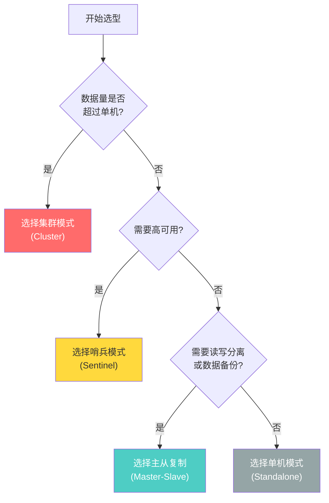

# Redis架构对比

## 一、 架构进化史速览

为了直观理解，我们先回顾一下这三种模式的架构图及核心定位：

**1. 主从复制（Master-Slave）—— “基础架构，读写分离”**

它是所有高可用方案的基石。解决了数据备份和读请求扩展的问题，但需要人工介入处理主节点故障，且存在单机存储和写入瓶颈。

**2. 哨兵模式（Sentinel）—— “自动容错，高可用”**

在主从复制的基础上，引入了独立的“哨兵”集群进行监控和自动故障转移。解决了主节点宕机导致服务不可用的问题，但依然没有突破单机内存和写并发的物理上限。

**3. 集群模式（Cluster）—— “终极形态，去中心化分片”**

彻底抛弃了单主架构，采用多主多从、去中心化的设计，通过 16384 个哈希槽进行数据分片。不仅自带故障转移能力，还真正实现了内存容量和读写性能的无限（理论上）水平扩展。

---

## 二、 核心能力详细对比表

这是三者在各项关键指标上的最直观对比：

| 对比维度 | 主从复制 (Master-Slave) | 哨兵模式 (Sentinel) | 集群模式 (Cluster) |
| --- | --- | --- | --- |
| **数据分布** | 全量数据集中在单主节点 | 全量数据集中在单主节点 | 数据打散分片存储在多个主节点 |
| **内存上限** | 受限于单台物理机内存 | 受限于单台物理机内存 | 无上限（可通过横向加机器扩容） |
| **写操作能力** | 单点写入，存在 QPS 瓶颈 | 单点写入，存在 QPS 瓶颈 | 多主并发写入，水平扩展极强 |
| **读操作能力** | 可通过增加从节点扩展 | 可通过增加从节点扩展 | 可通过增加集群节点/从节点扩展 |
| **高可用性/容灾** | **无**（需人工手动切换） | **高**（自动选主与故障转移） | **极高**（去中心化，局部故障不影响全局） |
| **部署成本** | 低（至少 2 台机器） | 中（至少需要 1主+2从+3哨兵） | 高（官方建议至少 3主+3从） |
| **运维复杂度** | 极低 | 中等 | **极高**（涉及槽位分配、扩缩容数据迁移） |
| **多键操作支持** | 完美支持 | 完美支持 | **受限**（跨槽操作需使用 Hash Tag） |

---

## 三、 实战架构选型指南（到底该选谁？）

在实际生产环境中，脱离业务场景谈架构都是耍流氓。你可以根据以下决策树来选择：

1. **什么时候选【主从复制】？**

   * **场景：** 数据重要性一般，允许停机维护，或者你的系统正处于极早期的验证阶段。

   * **现状：** 现代生产环境中，几乎**不再单独使用**纯粹的主从复制，它通常只作为其他两种模式的底层机制存在。

2. **什么时候选【哨兵模式】？**

   * **场景：** 数据量在单机内存承受范围内（通常建议单实例数据不要超过 10GB~20GB，以免引发全量复制卡顿或 RDB 备份导致磁盘 IO 阻塞），但对系统的高可用性（SLA）要求很高，不能容忍长时间宕机。

   * **现状：** **中小型公司和绝大多数常规业务的首选**。它足够稳定，客户端支持完美，运维成本可控。

3. **什么时候选【集群模式 Cluster】？**

   * **场景：** 典型的“三高”场景——海量数据（缓存总容量几十 GB 甚至上 TB）、超高并发读写（单机十万 QPS 已经扛不住了），且未来预见需要频繁的横向扩容。

   * **现状：** **大型互联网公司、核心高并发交易链路的标配**。享受高性能的同时，你需要接受复杂的运维挑战以及放弃部分多键事务的便利性。

| 场景               | 推荐模式                   |
| ------------------ | -------------------------- |
| 开发/测试环境      | 单机或主从复制             |
| 读多写少，需高可用 | 哨兵模式                   |
| 大数据量，高并发   | 集群模式                   |
| 简单数据备份       | 主从复制                   |
| 生产环境关键业务   | 集群模式（推荐）或哨兵模式 |

## 四、最佳实践

### 1 主从复制

- 从节点设置为只读：`replica-read-only yes`
- 合理设置复制积压缓冲区大小
- 使用持久化避免全量同步

### 2 哨兵模式

- 至少部署 3 个哨兵节点
- 哨兵节点应分布在不同物理机
- 设置合理的 `down-after-milliseconds`

### 3 集群模式

- 生产环境至少 3 主 3 从
- 主从节点分布在不同物理机
- 使用 Hash Tag 优化多键操作
- 监控集群状态和槽位分布
