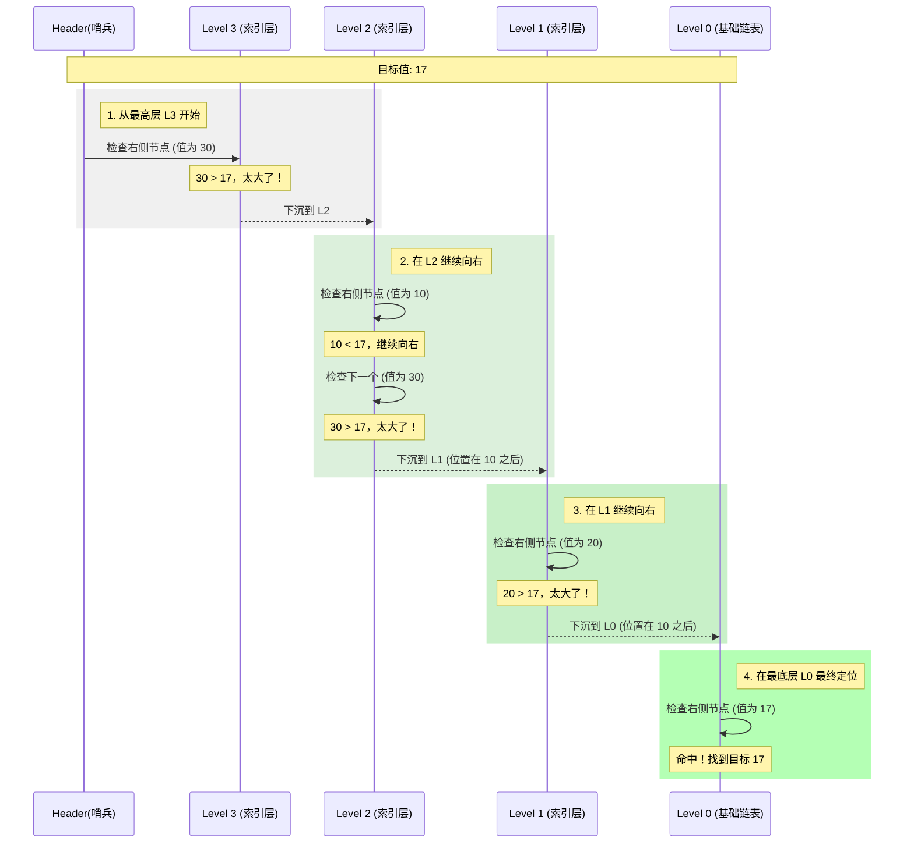
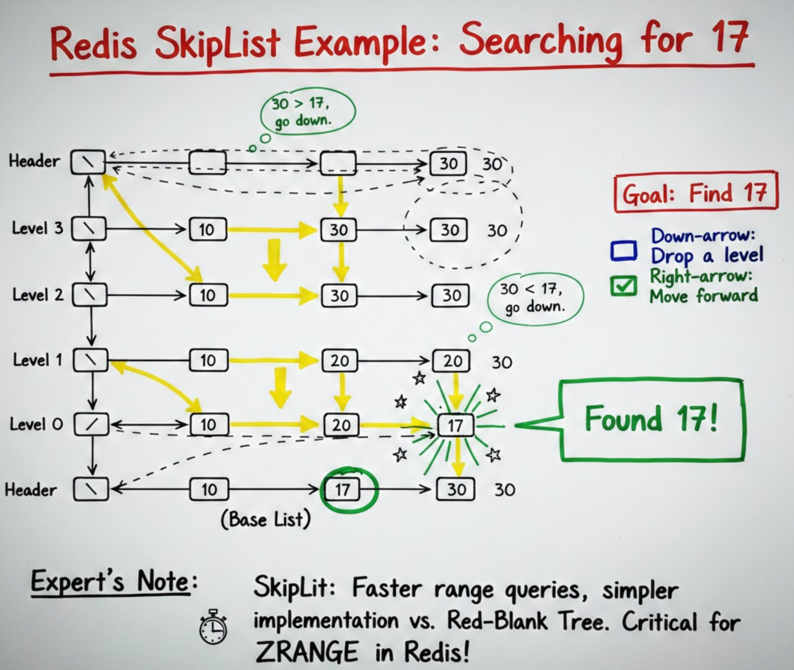

# 数据结构

Redis 开发者为了榨干内存性能，并没有直接使用 C 语言的原生结构，而是设计了一套精妙的**底层编码（Internal Encoding）**。

一个 Redis 对象（如 String）在不同数据量下，底层可能会自动切换不同的存储结构。

## Redis 对象头 (redisObject)

这是所有 Redis Key-Value 的通用入口。

```c
/* 所有的 Redis 对象都由这个结构体定义 */
typedef struct redisObject {
    unsigned type:4;       // 逻辑类型: string, list, hash, set, zset
    unsigned encoding:4;   // 底层编码: raw, int, ht, skiplist, listpack...
    unsigned lru:LRU_BITS; // LRU/LFU 淘汰策略相关信息
    int refcount;          // 引用计数（用于对象共享，如 0-9999 的整数）
    void *ptr;             // 指向底层具体数据结构的指针
} robj;
```

------

## 1. SDS (Simple Dynamic String) —— 简单动态字符串

**对应：** String 类型的底层。

- **结构：** 包含 `len`（已用长度）、`alloc`（分配总量）和 `buf[]`（字节数组）。
- **优势：**
  - **`O(1)` 获取长度**：直接读取 `len`。
  - **空间预分配**：减少内存重分配次数。
  - **惰性空间释放**：删除字符时不立即回收内存，留作后用。
  - **二进制安全**：可以存储图片、音频等二进制数据。

Redis 5.0 之后根据字符串长度定义了多套 `sdshdr`（5/8/16/32/64），最典型的是 `sdshdr8`：

```c
struct __attribute__ ((__packed__)) sdshdr8 {
    uint8_t len;         // 已使用的字节长度
    uint8_t alloc;       // 已分配的总字节长度（不含头和 \0）
    unsigned char flags; // 标志位，表示是哪种 sdshdr 类型
    char buf[];          // 字节数组，真正存数据的地方
};
```

------

## 2. ZipList (压缩列表)

**对应：** List, Hash, ZSet 在数据量较小时的实现。

为了节约内存，Redis 设计了一种连续内存块组成的顺序型结构。

- **特点：** 没有指针，通过记录前一个节点的长度来偏移寻址。
- **缺点：** 连锁更新问题。如果一个节点长度变化，可能导致后续所有节点重新分配空间。
- **进化：** 在 Redis 7.0 后，ZipList 已逐渐被 **ListPack** 取代，彻底解决了连锁更新隐患。

------

## 3. QuickList (快速列表)

**对应：** List 类型的底层实现。

它是 **双向链表** 和 **ZipList** 的结合体。

- **原理：** 每一个双向链表的节点（Node）里面都存了一个 ZipList。
- **意义：** 纯双向链表指针占用空间大且容易产生碎片；纯 ZipList 修改效率低。QuickList 取二者之长，平衡了内存和性能。

```c
typedef struct quicklist {
    quicklistNode *head;        // 指向头节点
    quicklistNode *tail;        // 指向尾节点
    unsigned long count;        // 所有 nodes 中元素的总个数
    unsigned long len;          // nodes 的个数
    // ... 其他压缩与填充参数
} quicklist;

typedef struct quicklistNode {
    struct quicklistNode *prev; // 前驱指针
    struct quicklistNode *next; // 后继指针
    unsigned char *entry;       // 指向具体的 listpack (或旧版的 ziplist)
    size_t sz;                  // 当前 listpack 的总大小
    unsigned int count : 16;    // 当前 listpack 中包含的元素个数
    // ...
} quicklistNode;
```

------

## 4. Dict / HashTable (字典/哈希表)

**对应：** Hash, Set 的底层实现。

Redis 的 Dict 采用了类似 Java `HashMap` 的数组+链表结构。

**核心特性：渐进式 Rehash**。

- 当哈希表需要扩容时，Redis 不会一次性搬迁数据（防止阻塞），而是维护两个哈希表 `ht[0]` 和 `ht[1]`。
- 在后续的每次增删改查中，顺带搬迁一部分数据，直到搬完。

```c
struct dict {
    dictType *type;     // 类型特定函数（如 hash 函数）
    dictEntry **ht_table[2]; // 两个哈希表，ht_table[1] 只在 rehash 时使用
    unsigned long ht_used[2]; // 记录两个表分别已用的 entry 数量
    long rehashidx;     // rehash 进度标识，-1 表示不在 rehash
    // ...
};

typedef struct dictEntry {
    void *key;                // 键
    union {
        void *val;
        uint64_t u64;
        int64_t s64;
        double d;
    } v;                      // 值（联合体，节省内存）
    struct dictEntry *next;   // 拉链法解决哈希冲突的链表指针
} dictEntry;
```

------

## 5. SkipList (跳跃表)

**对应：** ZSet (有序集合) 数据量大时的实现。

这是 Redis 实现 `O(log N)` 查找效率的核心武器。

- **原理：** 在普通链表的基础上增加多层索引。通过随机化算法决定每个节点的层数。
- **对比：** 相比红黑树，跳跃表在范围查询（`ZRANGE`）时效率更高，且实现逻辑更简单。

```c
typedef struct zskiplistNode {
    sds ele;                          // 成员元素
    double score;                     // 分数
    struct zskiplistNode *backward;   // 后退指针（用于倒序遍历）
    struct zskiplistLevel {
        struct zskiplistNode *forward; // 前进指针
        unsigned long span;            // 跨度（用于计算 rank 排名）
    } level[];                        // 层级数组（随机层数）
} zskiplistNode;

typedef struct zskiplist {
    struct zskiplistNode *header, *tail;
    unsigned long length;             // 节点数量
    int level;                        // 目前最大层级
} zskiplist;
```

### SkipList 查询原理图

在这个例子中，我们有 4 层索引（L0 是原始链表）。

**查询规则**：从最高层开始，如果当前节点的下一个节点值大于目标值，则下沉一层；如果小于或等于，则向右移动。



### 查询步骤详解

结合上面的流程，查询 **17** 的具体逻辑如下：

1. **从顶层出发**：Header 指针发现 L3 的第一个节点是 **30**。因为 30 > 17，说明目标在 Header 和 30 之间。**动作：下沉到 L2**。
2. **横向跨越**：在 L2，发现第一个节点是 **10**。因为 10 < 17，所以跳到 10。再看 10 的下一个是 **30**，太大了。**动作：在 10 处下沉到 L1**。
3. **微调搜索**：在 L1，10 的下一个是 **20**。因为 20 > 17，进不去。**动作：在 10 处下沉到 L0**。
4. **最终落地**：在 L0（原始链表），10 的下一个节点恰好是 **17**。**动作：返回结果**。



------

## 6. IntSet (整数集合)

**对应：** Set 类型且元素全是整数时的实现。

- **原理：** 内存连续的数组，数据按从小到大有序排列。
- **升级机制：** 如果原本是 16 位整数，插入一个 32 位整数时，整个数组会升级到 32 位，但不支持降级。

当 Set 里全是整数时的紧凑存储。

```c
typedef struct intset {
    uint32_t encoding; // 编码方式: 16位、32位或64位整数
    uint32_t length;   // 元素数量
    int8_t contents[]; // 柔性数组，按从小到大排列
} intset;
```

------

## 7. 底层结构与类型的对应关系

| **类型**   | **可能的底层编码 (Encoding)**    | **触发切换的条件 (通常)**           |
| ---------- | -------------------------------- | ----------------------------------- |
| **String** | int, embstr, raw                 | 根据字符长度和是否为数字自动切换    |
| **List**   | quicklist                        | 现代版本统一使用 quicklist          |
| **Hash**   | listpack (原 ziplist), hashtable | 元素数量 > 512 或单个元素 > 64 字节 |
| **Set**    | intset, hashtable                | 元素非整数 或 数量 > 512            |
| **ZSet**   | listpack (原 ziplist), skiplist  | 元素数量 > 128 或单个元素 > 64 字节 |


```mermaid
```

