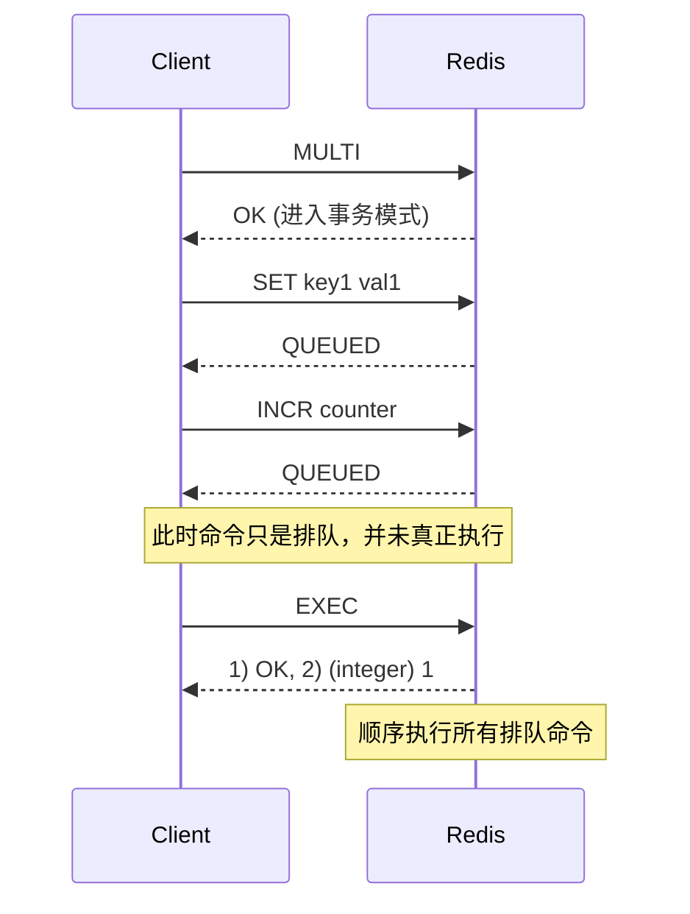

# 事务

Redis 的事务（Transaction）与传统关系型数据库（如 MySQL）的事务有着本质的区别。

在 Redis 中，事务更像是一个“**打包批处理脚本**”，它保证了命令执行的**隔离性**和**原子性**（某种程度上的），但**不支持回滚（Rollback）**。

---

## 1. 事务的核心指令

Redis 事务围绕以下四个核心命令展开：

* **`MULTI`**：开启事务。此后的命令不会立即执行，而是进入一个队列（Queue）。
* **`EXEC`**：提交事务。Redis 会按照顺序一次性执行队列中的所有命令。
* **`DISCARD`**：放弃事务。清空命令队列并退出事务状态。
* **`WATCH`**：**乐观锁**。监视一个或多个 Key，如果在 `EXEC` 执行前这些 Key 被其他客户端修改了，整个事务将失败。

---

## 2. 事务的三个阶段

---

## 3. Redis 事务的两大特性（重点）

### A. 隔离性（Isolation）

在 `EXEC` 执行期间，Redis 不会插入执行其他客户端的请求。这保证了事务内的命令序列是作为一个整体连续执行的。

### B. 并不完全的原子性（No Rollback）

**Redis 事务不支持回滚。**

* **语法错误（编译时错误）**：如果在入队（QUEUED）阶段命令报错（如指令不存在），`EXEC` 时整个事务都会被丢弃。
* **运行时错误**：如果命令入队成功，但在执行时报错，**Redis 会跳过报错的命令，继续执行后续指令**。已执行成功的命令不会撤销。

从实用性的角度来说，失败的命令是由编程错误造成的，应该避免。

---

## 4. 进阶：使用 WATCH 实现乐观锁

在分布式环境下，你可能需要根据某个 Key 的值来决定是否执行后续操作。

1. **`WATCH balance`**：开始盯着账户余额。
2. **`MULTI`**：开启事务。
3. **`DECRBY balance 100`**：扣款。
4. **`EXEC`**：如果在第一步到第四步之间，有别人动了 `balance`，`EXEC` 会返回 `nil`，事务失败。

---

## 建议

* **Lua 脚本 > 事务**：现代 Redis 开发中，专家通常建议使用 **Lua 脚本**。Lua 脚本在执行时也是原子的，且支持复杂的逻辑判断（If/Else），比 `MULTI/EXEC` 更强大、性能更好。
* **Pipeline 区别**：Pipeline 是为了减少网络往返耗时，不保证原子性；事务保证原子执行，但会有入队开销。
