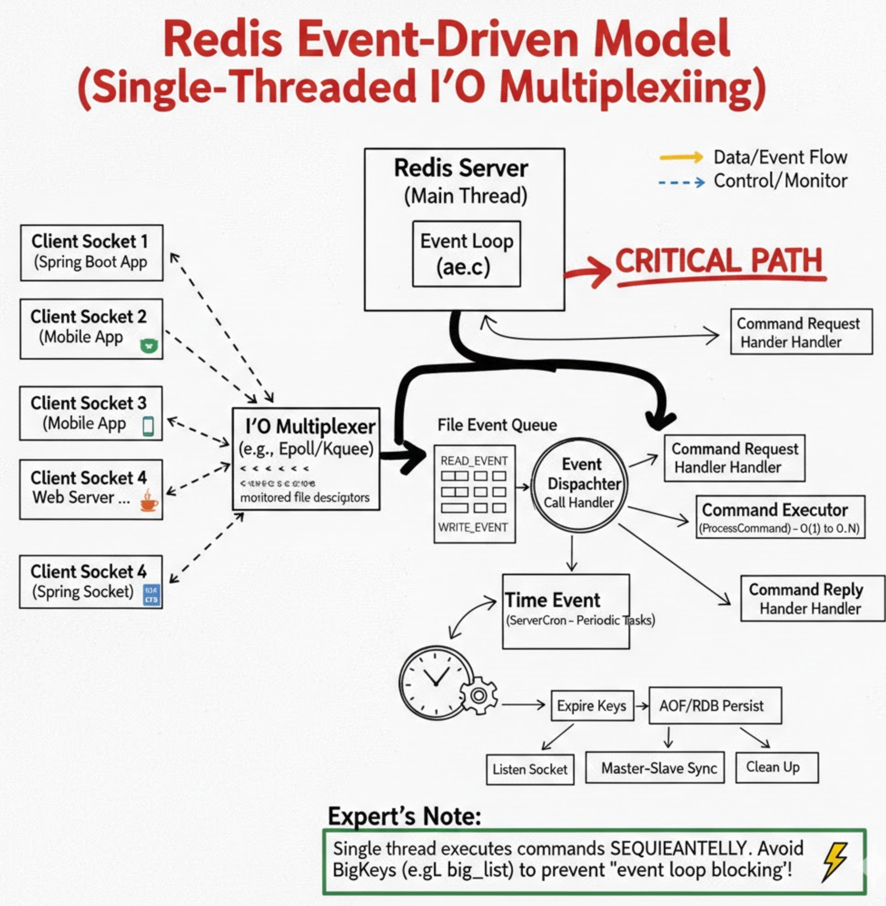

# 事件

Redis 之所以能以“单线程”抗住数十万的高并发，其核心“发动机”就是它的**事件驱动模型（Event-Driven Model）**。

Redis 的事件循环（Event Loop）主要处理两类事件：**文件事件（File Event）**和**时间事件（Time Event）**。

---

## 1. 文件事件 (File Event) —— 核心吞吐来源

文件事件是对套接字（Socket）操作的抽象。Redis 基于 **Reactor 模式** 开发了自己的网络事件处理器。

**I/O 多路复用**：Redis 利用 `select`、`poll`、`epoll`（Linux）或 `kqueue`（FreeBSD）来同时监听多个 Socket。它会根据操作系统自动选择性能最高的实现。

**组成部分**：

1. **套接字**：连接的客户端。
2. **I/O 多路复用程序**：负责监听并向队列推送产生事件的套接字。
3. **文件事件分派器**：根据事件类型调用相应的处理器。
4. **事件处理器**：如连接应答处理器、命令请求处理器、命令回复处理器。

---

## 2. 时间事件 (Time Event) —— 定期内务处理

时间事件是 Redis 在给定的时间点异步执行的操作。

**分类**：

* **定时事件**：在未来某个时间执行一次（Redis 内部目前较少使用）。
* **周期性事件**：每隔一段时间执行一次（如著名的 `serverCron`）。

**`serverCron` 的职责**：


* 更新服务器的统计信息（LRU 采样、内存占用等）。
* 清理数据库中的过期键值对。
* 关闭失效的连接。
* 尝试进行 AOF 或 RDB 持久化操作。
* 如果是从服务器，定期进行主从同步。

---

## 3. 事件循环的工作流程 (Event Loop)

Redis 的主进程会不断循环执行以下逻辑：

1. **计算最近的时间事件**：查看距离下一个 `serverCron` 还有多久。
2. **阻塞等待文件事件**：调用 `epoll_wait`，超时时间设置为步骤 1 计算出的时长。
3. **处理文件事件**：如果 Socket 有数据进来，执行命令。
4. **处理时间事件**：执行到期的 `serverCron` 任务。

### 伪代码

```c
// Redis 事件循环的主入口 (参考 aeMain 函数)
void aeMain(aeEventLoop *eventLoop) {
    eventLoop->stop = 0;
    
    // 只要没有停止，就一直循环
    while (!eventLoop->stop) {
        
        // 1. 开始处理事件 (核心入口)
        aeProcessEvents(eventLoop, AE_ALL_EVENTS);
        
    }
}

// 事件处理的核心逻辑 (参考 aeProcessEvents 函数)
int aeProcessEvents(aeEventLoop *eventLoop, int flags) {
    
    // --- 第一步：计算最近的时间事件 ---
    // 检查时间事件链表，看看最近的一个定时任务（如 serverCron）还有多久触发
    timeEvent *shortest = aeSearchNearestTimer(eventLoop);
    struct timeval tv, *tvp;

    if (shortest) {
        // 计算距离现在的时间差，作为接下来 epoll 的超时时间
        long ms = shortest->when - getTimeInMs();
        tv.tv_sec = ms / 1000;
        tv.tv_usec = (ms % 1000) * 1000;
        tvp = &tv;
    } else {
        // 如果没有时间事件，则无限期等待直到有网络请求进入
        tvp = NULL; 
    }

    // --- 第二步：阻塞等待文件事件 (I/O 多路复用) ---
    // 调用 epoll_wait (或 select/kqueue)，让出 CPU，直到：
    // a. 有客户端请求进入（读/写事件）
    // b. 或者到了最近的时间事件触发点（超时返回）
    int numevents = aeApiPoll(eventLoop, tvp);

    // --- 第三步：处理已触发的文件事件 ---
    for (int i = 0; i < numevents; i++) {
        aeFileEvent *fe = &eventLoop->events[eventLoop->fired[i].fd];
        int mask = eventLoop->fired[i].mask;
        int fd = eventLoop->fired[i].fd;

        // 如果是读事件：调用 readQueryFromClient (读取命令并执行)
        if (mask & AE_READABLE) fe->rfileProc(eventLoop, fd, fe->clientData, mask);
        
        // 如果是写事件：调用 sendReplyToClient (将结果发回客户端)
        if (mask & AE_WRITABLE) fe->wfileProc(eventLoop, fd, fe->clientData, mask);
    }

    // --- 第四步：处理时间事件 (后台任务) ---
    // 此时 epoll 已经返回，可能已经到了执行 serverCron 的时间
    if (flags & AE_TIME_EVENTS) {
        processTimeEvents(eventLoop);
    }

    return numevents;
}
```

### 代码解析

1. **“时间事件”决定了阻塞多久**： Redis 不会盲目地死等网络请求。它会先看一眼：“哎，还有 5 毫秒我就该去清理过期 Key 了”，于是它告诉内核：“你在 `epoll_wait` 那里最多等我 5 毫秒，没请求也得放我回来”。这就是为什么 Redis 能在单线程里精准地兼顾**高并发响应**和**后台内务**。
2. **先文件，后时间**： 你会发现代码里先处理 `aeApiPoll` 返回的请求，再处理 `processTimeEvents`。这是因为**处理客户端请求永远是最高优先级**。
3. **单线程的“阻塞”真相**： 如果 `fe->rfileProc`（即执行具体的命令，如 `GET` 或 `SET`）耗时太久，那么循环就被卡在第三步。**第四步的时间事件会被推迟，后续循环的第一步也会被卡住。** 这就是为什么在你的 **Kubernetes** 环境中，如果某个 Pod 的 CPU 被严重抢占，或者你执行了 `KEYS *`，整个 Redis 实例会瞬间“失去响应”。

---

## 4. 为什么单线程还能这么快？

结合事件模型，我们可以总结出 Redis 高性能的三个秘密：

1. **纯内存操作**：所有处理都在内存中完成。
2. **非阻塞 I/O**：即使命令还没准备好，也不会让线程死等。
3. **避免竞争**：单线程处理所有请求，彻底告别了**多线程上下文切换**和**锁（Lock）的性能开销**。

---

### 理解事件模型

* **大 Key 阻塞风险**：由于处理文件事件是单线程的，如果你在执行一个耗时极长的命令（如 `DEL` 一个百万元素的集合），它会阻塞事件循环。此时，哪怕其他 Socket 有数据进来，Redis 也无法处理，导致 Spring Boot 端的连接超时。
* **K8s 网络插件延迟**：在 K8s 环境中，如果网络插件（如 Calico）的性能不佳，会导致 `epoll` 返回的速度变慢，这在 Redis 监控中表现为 `process_latency` 升高。

