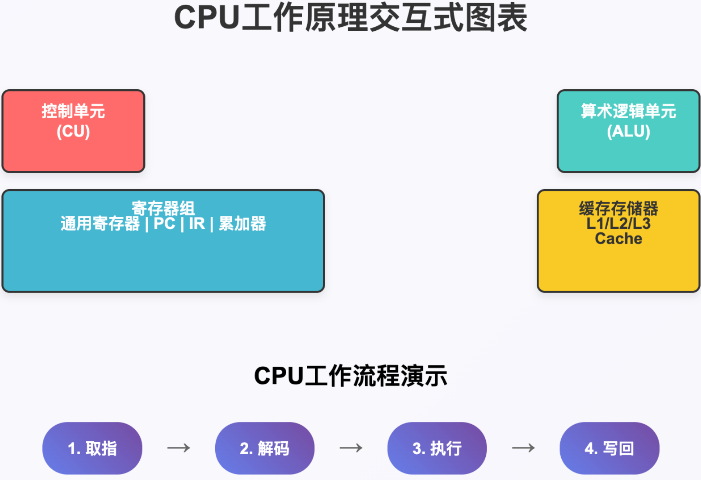
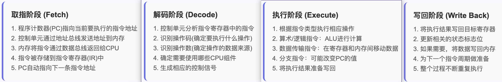

# CPU

CPU（Central Processing Unit，中央处理器）是计算机系统的核心组件，被称为计算机的"大脑"。

## CPU的基本概念

CPU是负责执行程序指令、进行数据处理和控制计算机各部件协调工作的核心硬件。

它从内存中取出指令和数据，进行解析和执行，然后将结果存储回内存或输出到其他设备。

## CPU的主要组成部分

**1. 控制单元（Control Unit, CU）**

控制单元是CPU的指挥中心，负责指令的获取、解码和执行控制：

- 从内存中获取指令
- 解码指令确定操作类型
- 协调CPU各部件的工作
- 产生控制信号管理数据流
- 维护程序执行的顺序

**2. 算术逻辑单元（Arithmetic Logic Unit, ALU）**

ALU是CPU的计算核心，执行：

- 算术运算：加法、减法、乘法、除法
- 逻辑运算：与、或、非、异或
- 比较操作：大于、小于、等于
- 移位操作：左移、右移
- 是CPU实际进行数据处理的地方

**3. 寄存器组（Registers）**

寄存器是CPU内部的高速存储器：

- 通用寄存器：存储临时数据
- 程序计数器(PC)：指向下一条指令地址
- 指令寄存器(IR)：存储当前执行的指令
- 累加器：存储运算结果
- 访问速度最快，但容量很小

**4. 缓存（Cache）**

缓存是CPU和内存之间的高速缓冲区：

- L1缓存：最快，容量最小，通常分为指令缓存和数据缓存
- L2缓存：速度较快，容量较大
- L3缓存：某些CPU具有，容量更大但速度相对较慢
- 利用程序局部性原理提高访问效率
- 显著减少CPU等待内存的时间

## CPU的工作原理

CPU的工作遵循"取指-解码-执行"的基本循环：

**1. 取指（Fetch）**

- 从内存中读取下一条要执行的指令
- 程序计数器指向当前指令的地址

**2. 解码（Decode）**

- 分析指令的操作码和操作数
- 确定需要执行什么操作以及操作的数据来源

**3. 执行（Execute）**

- ALU执行具体的运算操作
- 将结果存储到指定位置

**4. 写回（Write Back）**

- 将执行结果写回寄存器或内存

## CPU的重要技术特征

**1. 时钟频率**

- 以赫兹（Hz）为单位，表示CPU每秒能执行的时钟周期数
- 现代CPU频率通常在几个GHz

**2. 核心数量**

- 单核、双核、四核、八核等
- 多核可以并行处理多个任务

**3. 指令集架构**

- x86、x86-64、ARM、RISC-V等
- 定义了CPU能识别和执行的指令类型

**4. 制程工艺**

- 如7nm、5nm等，数字越小代表晶体管越小，功耗越低，性能越好

## 现代CPU的高级特性

**1. 流水线技术**

- 将指令执行过程分解为多个阶段
- 允许多条指令同时在不同阶段执行，提高效率

**2. 超标量技术**

- 一个时钟周期内可以执行多条指令
- 通过多个执行单元实现并行处理

**3. 分支预测**

- 预测程序分支的走向
- 减少因分支跳转造成的性能损失

**4. 乱序执行**

- 允许指令不按程序顺序执行
- 在保证结果正确的前提下优化性能

## CPU与其他组件的关系

CPU通过系统总线与其他组件通信：

- **与内存**：通过内存总线交换数据和指令
- **与存储设备**：通过I/O控制器访问硬盘、SSD等
- **与输入输出设备**：控制键盘、鼠标、显示器等设备

## 性能影响因素

CPU性能不仅取决于频率，还受以下因素影响：

- 缓存大小和层级
- 核心数量和线程数
- 指令集效率
- 制程工艺
- 散热设计